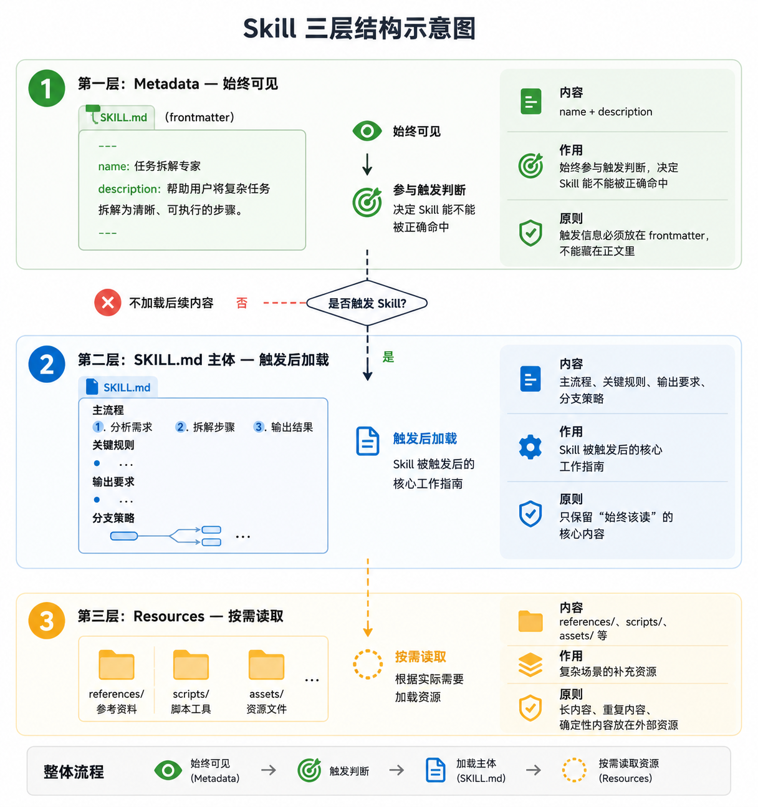
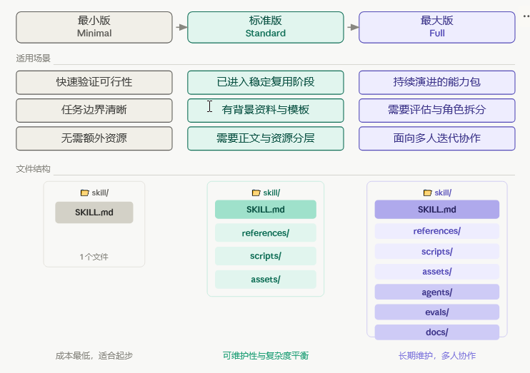
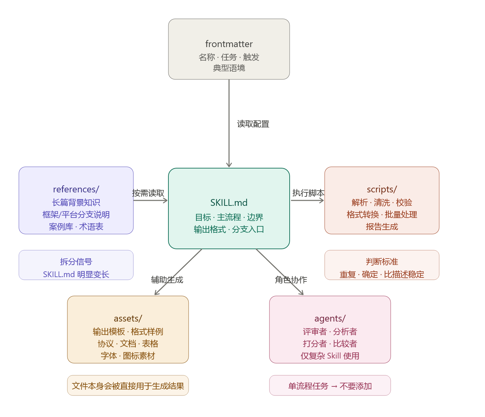
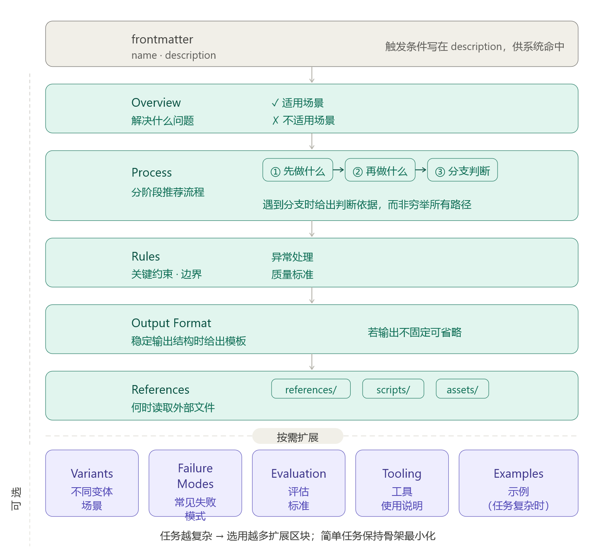
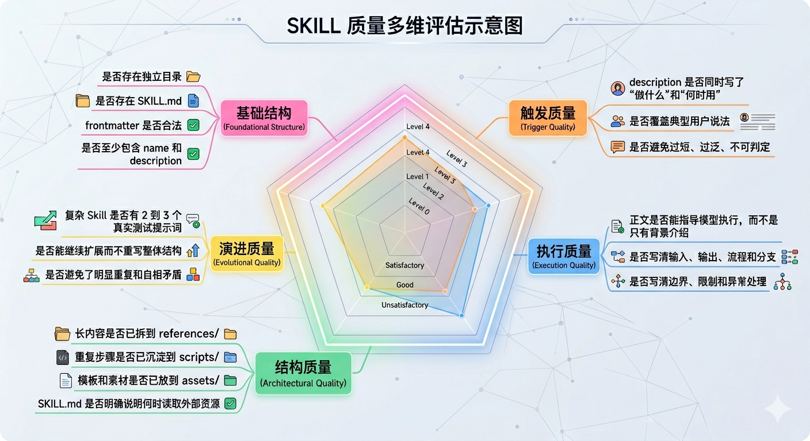

- Skill 的撰写指南：研读anthropic 的Skill仓库得到的结论

  本文中提到的内容已经放置于github仓库了：[how to write skills](https://github.com/dong2019/how-to-write-skills)

  在 AI Agent 开发中，Skill 是一个被严重低估却又极其重要的概念。它不是一份普通的说明文档，而是一个面向特定任务域的能力封装——通过明确的触发描述、结构化的操作指令和必要的附属资源，让模型在某类任务上表现得更稳定、更专业、更一致。

  写好一个 Skill，本质上是在回答三个问题：
  1. 这个 Skill 帮助模型更稳定地完成什么任务？
  2. 用户在什么表达或语境下，应该触发这个 Skill？
  3. 不使用 Skill 时，模型最容易在哪些环节犯错？
  如果你正在纠结"如何写出一个结构正确、可触发、可维护的 Skill"，这篇指南就是为你准备的。

  网络上有非常多教你撰写Skill的方案，但是不够深入。为了撰写一份能够良好的Skill，本人研读了Anthropic的Skill仓库（仓库网址为<https://github.com/anthropics/skills）>
  # Skill 的本质：三层加载机制
  在动手写之前，必须先理解 Skill 的天然分层结构。这决定了"什么内容应该放在哪里"

  
  | 层次  | 名称          | 加载时机  | 内容                                   | 作用                         | 原则                           |
  | --- | ----------- | ----- | ------------------------------------ | -------------------------- | ---------------------------- |
  | 第一层 | Metadata    | 始终可见  | `name` + `description`               | 始终参与触发判断，决定 Skill 能不能被正确命中 | 触发信息必须放在 frontmatter，不能藏在正文里 |
  | 第二层 | SKILL.md 主体 | 触发后加载 | 主流程、关键规则、输出要求、分支策略                   | Skill 被触发后的核心工作指南          | 只保留"始终该读"的核心内容               |
  | 第三层 | Resources   | 按需读取  | `references/`、`scripts/`、`assets/` 等 | 复杂场景的补充资源                  | 长内容、重复内容、确定性内容放在外部资源         |
  **Skill的**触发信息放在 frontmatter，核心工作流放在 SKILL.md，其余内容按需外移。
  # 从最小到最大：三种模板的选择
  Skill 不是越大越好，而是要匹配当前的复杂度阶段。研读了Anthropic的Skill仓库（仓库网址为<<https://github.com/anthropics/skills）>之后，本人总结出三套Skill模板。按照流程不断变化

  
  ## 最小版的结构
  **最小结构**：
  ```text
  skill-name/
  └── SKILL.md
  ```
  **最小 frontmatter**：
  ```yaml
  ---
  name: skill-name
  description: 说明这个 Skill 做什么，以及在什么场景下应该优先使用它。
  ---
  ```
  **最小正文骨架**：
  ```markdown
  # Skill Title

  一句话说明目标和适用范围。

  ## Process
  - 第一步做什么
  - 第二步做什么
  - 遇到例外情况怎么处理

  ## Rules
  - 哪些边界必须注意
  - 哪些行为不能做

  ## Output
  - 输出长什么样
  - 如果没有固定格式，也要说明输出重点
  ```
  ## 标准版：稳定复用
  ```text
  skill-name/
  ├── SKILL.md
  ├── LICENSE.txt
  ├── references/
  │   ├── overview.md
  │   ├── variants.md
  │   └── examples.md
  ├── scripts/
  │   ├── helper.py
  │   └── validate.py
  └── assets/
      ├── template.md
      └── sample-output.txt
  ```
  ## 最大版：长期演进
  ```text
  skill-name/
  ├── SKILL.md
  ├── LICENSE.txt
  ├── references/
  │   ├── overview.md
  │   ├── domain-a.md
  │   ├── domain-b.md
  │   ├── rules.md
  │   └── examples.md
  ├── scripts/
  │   ├── validate.py
  │   ├── transform.py
  │   ├── generate_report.py
  │   └── utils.py
  ├── assets/
  │   ├── templates/
  │   ├── samples/
  │   └── static/
  ├── agents/
  │   ├── reviewer.md
  │   ├── analyzer.md
  │   └── comparator.md
  ├── evals/
  │   └── evals.json
  └── docs/
      ├── design-notes.md
      └── changelog.md
  ```
  # 核心写作指南
  ## Description 怎么写：触发质量的关键
  **description** 是 Skill 能否被正确触发的核心。写差了，Skill 就很难被命中；写得过泛，又容易与其他 Skill 冲突。所以，一个合格的 description 至少要包含：
  - 任务是什么
  - 什么时候触发
  - 用户可能怎么表达
  - 哪些模糊语境也应归入本 Skill
  下面给出一个推荐公式：
  ```text
  用于 [目标任务]。当用户提到 [典型表达 / 典型场景 / 相近需求] 时，应优先使用此 Skill，即使用户没有明确说出 [关键词]。
  ```
  **反例**：
  ```text
  用于处理文档。
  ```
  **正例**：
  ```text
  用于撰写和整理结构化文档。当用户提到 PRD、技术方案、设计文档、决策记录、规范说明，或表达出"帮我把想法整理成正式文档"的意图时，应优先使用此 Skill，即使用户没有明确说出"文档模板"或"需求文档"等术语。
  ```
  ## 内容放置规则：别把所有东西都堆在 SKILL.md
  写 Skill 时，最常见的问题不是"不会写"，而是"内容放错层"。下面是直接可用的放置规则

  
  ## SKILL.md 推荐骨架
  下面给出一份我研读后的Skill结构。

  

  内容如下：
  ```markdown
  ---
  name: my-skill
  description: Explain what this skill does and when it should be used.
  ---

  # My Skill

  ## Overview
  说明这个 Skill 解决什么问题，适用于哪些场景，不适用于哪些场景。

  ## Process
  按阶段说明推荐流程：
  1. 先做什么
  2. 再做什么
  3. 遇到分支时如何判断

  ## Rules
  写关键约束、边界、异常处理和质量标准。

  ## Output Format
  如果输出有稳定结构，在这里给出模板。

  ## References
  说明什么时候需要读取 references/、scripts/、assets/ 中的哪个文件。
  ```
  ## 逐步升级策略：从最小到最大
  推荐按以下顺序扩展，而不是一开始建满所有目录：
  1. 先写最小可用版本：只有 SKILL.md时，写清 name、description、流程、边界、输出
  2. 当正文变长时，再拆 references/
  3. 当步骤重复且确定时，再加 scripts/
  4. 当输出依赖模板时，再加 assets/
  5. 当需要评估和迭代时，再加 evals/
  6. 当出现多角色协作时，再加 agents/
  这样的话，你才可以更好的阅读出内容呀
  # 验收清单
  写完一个 Skill 后，至少检查5个内容
  - 基础结构
  - 演进质量
  - 结构质量
  - 触发质量
  - 执行质量
  
  # 常见失败模式
  以下问题在撰写 Skill 时最常见：
  1. **description 只写功能，不写触发场景** — 导致 Skill 难被命中
  2. **description 过于宽泛，与其他 Skill 边界重叠** — 导致调用混乱
  3. **SKILL.md 只有概念，没有动作导向流程** — 导致模型不知道怎么执行
  4. **所有说明都堆在 SKILL.md，没有资源分层** — 导致上下文过长，核心信息被淹没
  5. **把本可脚本化的步骤写成大量重复文字** — 浪费 token 且不稳定
  6. **示例太偶然，导致 Skill 过拟合单一案例** — 泛化能力差
  7. **规则很多，但没有解释为什么重要** — 模型容易忽略或误解
  8. **结构一开始做得过大，后续难以维护** — 维护成本高，实际用不上
  # 最终建议
  如果你要新写一个 Skill，可以直接按下面的策略执行：
  1. 先写一个最小版本，只保留 SKILL.md
  2. 优先把 description 写对，因为它决定能否触发
  3. 在正文中只保留"始终该读"的核心流程
  4. 只在复杂度真实上升后，再增加 references/、scripts/、assets/
  5. 当 Skill 开始进入优化期，再增加 evals/ 和 agents/
  # 参考内容
  - [Anthropic Skills](https://github.com/anthropics/skills)
  - [Agent Skills Specification](https://agentskills.io/specification)


